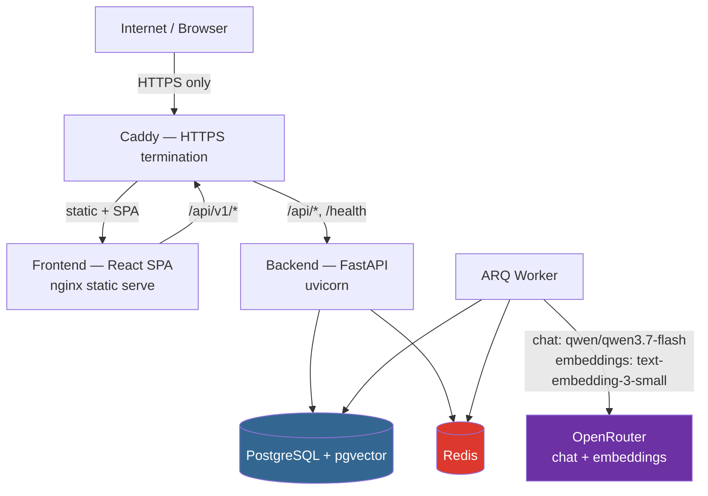

# ForgeMind AI Operations

**Language:** English | [Українська](README.uk.md)

**Controlled AI-assisted Supply Risk Intelligence** — a portfolio MVP demonstrating one complete, auditable, human-approved vertical workflow from production plan to procurement decision.

> **Live public Demo:** **https://demo.forgemind-ai.tech/**
>
> The public portfolio Demo is **live and independently verified** (deployed candidate `edbbc938`, verification passed 2026-08-29). This is a verified public Demo — it is **not** formal Release 1 production acceptance. Release 1 remains NOT READY / NOT DEPLOYED; staging and production remain NOT STARTED.

**Source Code:** https://github.com/Tihonya/forgemind-ai-operations

**License:** Apache License 2.0 (see [LICENSE](LICENSE))

---

## What is ForgeMind?

ForgeMind is a web platform for AI-assisted supply chain risk assessment in engineering and manufacturing environments. It demonstrates how an LLM can produce grounded, cited, structured risk recommendations while every consequential action remains behind a human approval gate with a complete, immutable audit trail.

The portfolio MVP implements one vertical scenario — **Production Plan Supply Risk Review** — end to end against synthetic data. No real corporate, military, or confidential systems are involved.

---

## The Golden Scenario

A Production Manager opens a synthetic production plan, runs supply risk analysis, and receives AI-generated recommendations with document citations. The manager requests approval for a proposed procurement action. A Procurement Specialist independently approves or rejects it. On approval, a controlled procurement task is created. The Auditor inspects the complete audit trail.

```
Production Plan
  → Deterministic risk calculation
  → RAG evidence retrieval with citations
  → Structured AI recommendation
  → Human approval request
  → Independent procurement decision
  → Controlled procurement task creation
  → Immutable audit trail
```

Every step is persisted, correlated, and auditable. Analytical workflow steps run before approval — deterministic risk calculation, RAG evidence retrieval, and structured AI recommendation generation all execute automatically — but no consequential procurement task is created without the required independent human approval. No real ERP system is connected — the procurement task is a synthetic local record.

---

## Implemented Capabilities

All capabilities below are implemented and tested in the repository. Acceptance tests AT-003 through AT-013 are PASS.

| Capability | Evidence |
|-----------|----------|
| Authentication and RBAC (JWT, 5 demo roles) | AT-002 implemented; requires deployment verification |
| Synthetic production / supply-risk domain (BOM, inventory, suppliers) | AT-003 PASS |
| Deterministic risk calculation (Python/SQL) | AT-004, AT-005 PASS |
| RAG over synthetic engineering documents with citations | AT-006, AT-007 PASS |
| Role-filtered document access (DocumentPermission model) | AT-007 PASS |
| Structured AI recommendation workflow (Pydantic-validated JSON) | AT-008 PASS |
| Automatic provider retry / outage handling | AT-013 PASS |
| User-initiated workflow retry | AT-013 PASS |
| Approval-request lifecycle (request → approve/reject) | AT-009, AT-011 PASS |
| Independent procurement approval (no self-approve) | AT-009, AT-010 PASS |
| Controlled procurement-task creation (from approved requests only) | AT-010 PASS |
| Immutable / auditable workflow events | AT-012 PASS |
| Approval Center (frontend) | AT-009, AT-010 PASS |
| Audit Log (frontend) | AT-012 PASS |
| Isolated disposable Demo environment | WP-P7-03, implemented |
| Deterministic operator-level Demo reset | `make demo-reset` |
| Three public Demo identities on login UX | WP-P7-04, implemented |
| Production-safe deployment configuration | WP-P7-02, prepared |
| Distributed application rate limiting (Redis-backed) | WP-P7-02, implemented |
| Backup/restore and operational controls | WP-P7-02, implemented |
| Live embedding gate (OpenRouter → OpenAI embeddings) | WP-P7-02, accepted (DEC-055) |

---

## Demo Roles

Three public Demo accounts are displayed on the login page for the isolated Demo environment:

| Account | Role | Responsibility |
|---------|------|-----------------|
| `manager.demo` | Production Manager | Initiates workflows, creates approval requests — cannot self-approve |
| `procurement.demo` | Procurement Specialist | Independently approves or rejects procurement actions |
| `auditor.demo` | Auditor | Inspects the audit trail — cannot approve |

Additional non-public demo identities exist in the seed data but are not presented as public Demo login options. Demo passwords are shown on the login page itself — they are not repeated in this README.

**Try it in 3–5 minutes:** the Ukrainian recruiter walkthrough [docs/demo-guide.uk.md](docs/demo-guide.uk.md) guides you through the full Manager → Procurement Specialist → Auditor journey on the live Demo.

---

## Architecture



**Trust and safety boundaries:**

- PostgreSQL and Redis are never published to host ports — they stay on private Docker networks
- Authentication is required for all application access (no anonymous access)
- All business and demo data are synthetic — no real corporate systems are connected
- Secrets remain outside Git (production `.env` is operator-owned, never committed)
- Human approval gates control every consequential action
- Interactive API docs (`/docs`, `/redoc`) are not exposed on the public origin

---

## Release 1 AI / RAG Configuration

The initial Release 1 deployment profile uses a bounded, explicitly pinned provider configuration:

| Component | Provider | Model | Mode |
|-----------|----------|-------|------|
| Chat | OpenRouter only | `qwen/qwen3.7-flash` | `json_object` |
| Embeddings | OpenRouter (OpenAI-compatible endpoint) | `openai/text-embedding-3-small` | 1536 dimensions |

Automatic provider fallback is **disabled** in the Release 1 profile. No Groq-first chain is used in the initial deployment.

The repository also contains a generic runtime chat-provider chain capability (Groq → OpenRouter ordered fallback) that can be configured for non-Release-1 scenarios. This is a runtime capability, not the initial deployment profile.

No secret values are stored in the repository. Provider keys are supplied through the operator's production `.env` file (see `infra/prod.env.example`).

---

## Quick Start

### Prerequisites

- Docker and Docker Compose
- Python 3.12 (for local development outside Docker)
- Node.js 22 (for frontend development)

### Development environment

```bash
# Clone
git clone https://github.com/Tihonya/forgemind-ai-operations.git
cd forgemind-ai-operations

# Configure (development defaults work for local dev)
cp .env.example .env

# Start all services in development mode
make dev

# Seed demo data (requires the Docker dev stack to be running)
make seed

# Access the application
# Frontend:  http://localhost:5173
# Backend:   http://localhost:8000
# API docs:  http://localhost:8000/docs
# Caddy:     http://localhost
```

### Local development (without Docker)

```bash
# Create root virtual environment
python3.12 -m venv .venv && source .venv/bin/activate

# Install backend dependencies
cd backend && pip install -e ".[dev]" && cd ..

# Install frontend dependencies
cd frontend && npm install && cd ..

# Run tests
make test

# Run linters
make lint
```

> **Note:** `make seed` requires the Docker development stack to be running
> (it uses `docker compose exec backend`). See the Docker-based development
> environment section above. Do NOT use `make seed` in a without-Docker workflow.

### Available Makefile commands

| Command | Purpose |
|---------|---------|
| `make dev` | Start all services in development mode |
| `make test` | Run all test suites (backend + frontend) |
| `make lint` | Run all linters (ruff, mypy, npm lint) |
| `make seed` | Seed the database with the golden dataset |
| `make demo-reset` | Reset the isolated disposable Demo environment |
| `make compose-validate` | Validate production Compose with template env |
| `make caddy-validate` | Validate production Caddyfile with placeholder env |
| `make config-validate` | Fail-closed production configuration validation |
| `make backup-smoke` | Run repo-owned backup/healthcheck test suites |
| `make smoke-prepare` | Offline embedding smoke preparation (no live provider call) |

---

## Isolated Demo Environment

The Release 1 Demo runs the **real** ForgeMind application stack — Caddy, nginx frontend, FastAPI backend, ARQ worker, PostgreSQL (pgvector), Redis — with production-grade security and provider behavior against **synthetic** demo data.

- No "demo mode" inside the application — the demo is distinguished by its Compose file and project identity, not by weakening the app
- Isolated volumes, database (`forgemind_demo`), and Compose project (`forgemind-demo`)
- PostgreSQL and Redis never publish host ports
- No Docker socket mounted into any container
- Reset is operator-level: `make demo-reset` destroys and rebuilds the entire demo runtime from scratch
- No in-app reset API or `reset_service.py` — the application backend has no destructive capabilities

See [docs/demo-environment.md](docs/demo-environment.md) for full details.

---

## Human Control and Auditability

ForgeMind demonstrates that AI-assisted decisions can be transparent and controllable:

- **No action without approval:** The AI generates recommendations, but no procurement task is created until a human approves the request
- **Separation of duties:** The manager who requests an action cannot approve it — a different identity (Procurement Specialist) must decide
- **Immutable audit trail:** Every workflow step, approval decision, procurement action, and state transition is persisted as an immutable audit event with actor, timestamp, and correlation ID
- **Full traceability:** Each recommendation links to its RAG evidence (retrieved document fragments with citations) and the deterministic risk calculation that triggered it
- **Auditor oversight:** The Auditor role can inspect the complete audit trail but cannot approve or modify anything

---

## Testing and Verification

| Suite | Tool | Scope |
|-------|------|-------|
| Backend unit + integration | pytest | Risk engine, workflow state machine, AI provider, approval/procurement, audit, RBAC |
| Frontend unit | Vitest | Components, hooks, routing, auth context |
| End-to-end | Playwright | Golden Scenario walkthrough |
| Acceptance harness | Custom harness | AT-003 through AT-013 (11 PASS; AT-001/002/014 require deployment) |
| Deployment config | Shell test suites | Compose validation, Caddyfile validation, backup/restore, demo reset, worker healthcheck |

Run tests: `make test`

---

## Documentation Map

| Document | Path |
|----------|------|
| Українська версія README | [README.uk.md](README.uk.md) |
| Ukrainian recruiter Demo walkthrough | [docs/demo-guide.uk.md](docs/demo-guide.uk.md) |
| Live Demo verification record | [docs/reviews/wp_dpr1_03a_live_demo_verification.md](docs/reviews/wp_dpr1_03a_live_demo_verification.md) |
| Source of Truth (9 documents) | [forgemind_project_source_of_truth/](forgemind_project_source_of_truth/) |
| Phase 7 deployment contract | [docs/planning/phase_7_deployment_contract.md](docs/planning/phase_7_deployment_contract.md) |
| Requirements traceability matrix | [docs/planning/requirements_traceability_matrix.md](docs/planning/requirements_traceability_matrix.md) |
| Product strategy | [docs/planning/wp_strat_01_product_strategy.md](docs/planning/wp_strat_01_product_strategy.md) |
| Production deployment runbook | [docs/infra-production.md](docs/infra-production.md) |
| Release 1 operator runbook | [docs/operations/release_1_runbook.md](docs/operations/release_1_runbook.md) |
| Isolated Demo environment | [docs/demo-environment.md](docs/demo-environment.md) |
| Demo Pre-Release 1 checkpoint | [docs/demo-pre-release-1.md](docs/demo-pre-release-1.md) |
| Current lifecycle status | [docs/next_steps.md](docs/next_steps.md) |
| Active work tracker | [docs/ACTIVE_WORK.md](docs/ACTIVE_WORK.md) |
| Decision log | [forgemind_project_source_of_truth/08_DECISION_LOG.md](forgemind_project_source_of_truth/08_DECISION_LOG.md) |

---

## Technology Stack

| Layer | Choice |
|-------|--------|
| Backend | Python 3.12, FastAPI, SQLAlchemy 2, Alembic |
| AI/ML | ARQ + Redis, OpenAI-compatible chat provider, pgvector embeddings |
| Frontend | React 18, TypeScript, Vite, Tailwind CSS, shadcn/ui |
| Database | PostgreSQL 16 + pgvector |
| Infra | Docker Compose, Caddy (automatic HTTPS), GitHub Actions |
| Testing | pytest, Vitest, Playwright |

---

## Limitations

ForgeMind is a **portfolio MVP**. The following are intentionally out of scope for Release 1:

- **Synthetic data only:** All production plans, BOMs, inventory, suppliers, documents, and audit events are synthetic. No real corporate ERP or procurement system is connected.
- **No Release 1 production deployment yet:** Release 1 has not been formally deployed or accepted. The public portfolio Demo at `https://demo.forgemind-ai.tech/` (DEC-056) is live and independently verified (candidate `edbbc938`, 2026-08-29); demo availability is not a Release 1 deployment, acceptance, or completion claim.
- **Ukrainian-first direction adopted and implemented in `main`:** Ukrainian is the default product language with English secondary (DEC-059); localization, localized statuses, guided approval flow and the Decision Trail are incorporated via PRs #128–#135 and described in [docs/demo-pre-release-1.md](docs/demo-pre-release-1.md). The public Demo runs this code level (candidate `edbbc938`) and passed independent live verification of the UA-04/UA-05 behavior on 2026-08-29 (see [docs/reviews/wp_dpr1_03a_live_demo_verification.md](docs/reviews/wp_dpr1_03a_live_demo_verification.md)).
- **Bounded deployment profile:** Initial deployment uses OpenRouter-only chat and embedding providers. A Groq-first fallback chain exists as a runtime capability but is not the initial deployment profile.
- **No CI/CD deployment automation:** First deployment is manual and checklist-driven.
- **No full observability platform:** Monitoring is limited to Docker logs, backend `/health`, and backup state markers.
- **No per-browser ephemeral sandboxes:** Release 1 uses one shared isolated Demo environment.
- **Broader enterprise/platform expansion:** Out of Release 1 scope.

---

## License

This project is licensed under the [Apache License 2.0](LICENSE).
