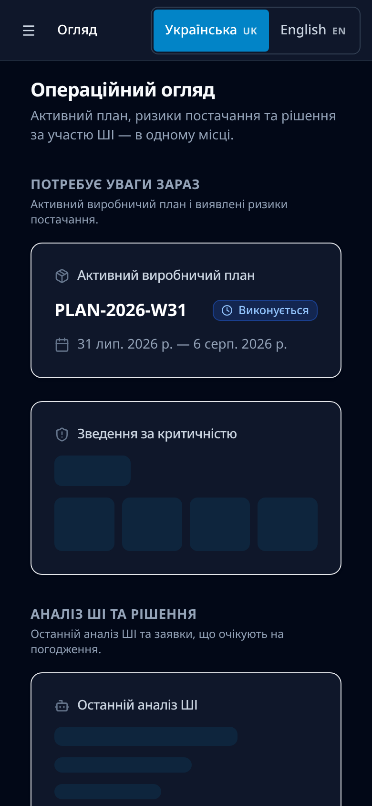

# ForgeMind — керований ШІ-аналіз ризиків постачання

**Мова:** Українська | [English](README.md)

> **Живе демо:** **https://demo.forgemind-ai.tech/**
>
> Публічне портфоліо-демо розгорнуто та незалежно перевірено (кандидат `edbbc938`, серпень 2026). Це верифіковане публічне демо — воно не є формальним релізом Release 1 та промисловим розгортанням у виробництві.
> **Портфоліо-реліз [`v0.1.0`](https://github.com/Tihonya/forgemind-ai-operations/releases/tag/v0.1.0) опубліковано** (2026-08-29) — це перший публічний портфоліо-реліз ForgeMind; це не production-розгортання і не production-приймання Release 1.

**Код проєкту:** https://github.com/Tihonya/forgemind-ai-operations
**Гайд для рекрутера (3–5 хв):** [docs/demo-guide.uk.md](docs/demo-guide.uk.md)
**Ліцензія:** Apache License 2.0 ([LICENSE](LICENSE))

---

## Що таке ForgeMind

ForgeMind — це вебплатформа для ШІ-асистованого оцінювання ризиків постачання у виробничих та інженерних компаніях. Проєкт демонструє, як велика мовна модель може готувати структуровані, підкріплені документами рекомендації, тоді як кожна дія, що має наслідки, залишається під контролем людини: рішення ухвалює інший співробітник, а кожен крок фіксується в незмінному журналі аудиту.

Це портфоліо-MVP, що реалізує один вертикальний сценарій — **перегляд ризиків постачання за виробничим планом** — від початку до кінця на синтетичних даних. Жодних реальних корпоративних, військових чи конфіденційних систем не задіяно.

## Бізнес-проблема

У виробництві дефіцит однієї критичної комплектуючої може зупинити збірку всього замовлення. Класична дилема: автоматика швидка, але безконтрольна; ручний процес контрольний, але повільний і непрозорий.

ForgeMind демонструє відповідь «і те, і те»:

- ШІ робить рутинну аналітику — збирає свідчення з документів і формує структуровані рекомендації;
- людина ухвалює рішення — і це обов'язково **інша людина**, а не автор запиту;
- аудитор у будь-який момент бачить повний, незмінний ланцюжок «від проблеми до дії».

## Золотий сценарій

Виробничий план → детермінований розрахунок ризику → пошук свідчень (RAG) із цитатами документів → структурована ШІ-рекомендація → запит на погодження → незалежне рішення спеціаліста з закупівель → контрольоване створення завдання на закупівлю → незмінний журнал аудиту.

Усі аналітичні кроки виконуються автоматично, але завдання на закупівлю не створюється без окремого людського погодження. Реальна ERP-система не підключається — завдання є синтетичним локальним записом.


## Ролі демо

Три публічні демо-облікові записи показані на сторінці входу:

| Обліковий запис | Роль | Відповідальність |
|-----------------|------|------------------|
| `manager.demo` | Керівник виробництва | Ініціює процеси, створює запити на погодження — не може погоджувати власні запити (самопогодження неможливе) |
| `procurement.demo` | Фахівець із закупівель | Незалежно погоджує або відхиляє дії |
| `auditor.demo` | Аудитор | Переглядає журнал аудиту — не може погоджувати чи змінювати |

**Паролі показано на сторінці входу демо.** Їх не дубльовано в репозиторії — і не потрібно шукати їх у коді.

Для різних ролей використовуйте окремі вікна браузера в режимі інкогніто або окремі профілі — інакше сесії перезаписуватимуть одна одну.

## Ключові принципи

- **ШІ-асистований аналіз.** Платформа детерміновано розраховує дефіцити, а ШІ готує резюме, вплив на бізнес і варіанти дій.
- **Обґрунтовані рекомендації.** Кожна рекомендація спирається на отримані фрагменти документів із цитатами (RAG), а не на «фантазії» моделі.
- **Людське погодження.** Жодне завдання на закупівлю не створюється без окремого погодження людини.
- **Розділення обов'язків.** Той, хто ініціює запит, не може його погодити — рішення ухвалює інший обліковий запис.
- **Контрольоване створення завдань.** Завдання на закупівлю створюється лише з погодженого запиту; повторне створення неможливе.
- **Незмінний журнал аудиту.** Кожен крок — подія з актором, часом та ідентифікатором кореляції; змінювати чи видаляти події через інтерфейс не можна.
- **Ланцюжок рішення.** Читабельний, доступний лише для перегляду ланцюжок «ризик → аналіз → рекомендація → погодження → завдання → події аудиту».

## Архітектура та технології

| Рівень | Вибір |
|--------|-------|
| Бекенд | Python 3.12, FastAPI, SQLAlchemy 2, Alembic |
| ШІ/ML | ARQ + Redis, OpenAI-сумісний провайдер чату, векторні подання (embeddings) у pgvector |
| Фронтенд | React 18, TypeScript, Vite, Tailwind CSS, shadcn/ui |
| База даних | PostgreSQL 16 + pgvector |
| Інфраструктура | Docker Compose, Caddy (автоматичний HTTPS), GitHub Actions |
| Тестування | pytest, Vitest, Playwright |

Браузер → Caddy (HTTPS) → React SPA / FastAPI; фонові завдання — ARQ-воркер; профіль розгортання Release 1 використовує OpenRouter (чат + вектори) без автоматичного фолбеку. Детальна схема — в англомовному [README](README.md#architecture).

## Безпека та межі довіри

- PostgreSQL і Redis ніколи не публікуються на порти хоста — лише приватні Docker-мережі.
- Увесь доступ до застосунку вимагає автентифікації (анонімного доступу немає).
- Усі бізнес- та демо-дані синтетичні — реальні корпоративні системи не підключені.
- Секрети залишаються поза Git (`.env` належить оператору, до репозиторію не потрапляє).
- Кожна дія, що має наслідки, проходить людське погодження.
- Інтерактивна документація API (`/docs`, `/redoc`) не публікується на публічному домені.

## Тестування та верифікація

| Набір | Інструмент | Охоплення |
|-------|-----------|-----------|
| Бекенд (юніт + інтеграція) | pytest | Рушій розрахунку ризиків, машина станів, ШІ-провайдер, погодження/закупівлі, аудит, RBAC |
| Фронтенд | Vitest | Компоненти, хуки, роутинг, контекст автентифікації |
| End-to-end | Playwright | Золотий сценарій, ланцюжок погодження |
| Приймальні тести | Власний тестовий каркас | AT-003 … AT-013 — 11 PASS |
| Конфігурація розгортання | Shell-тести | Compose, Caddy, бекап/відновлення, скидання демо |

Крім того, живе демо пройшло **незалежну перевірку на реальному середовищі** (2026-08-29): основний процес «керівник → фахівець з закупівель → аудитор», шлях відхилення, межі ролей, український інтерфейс, мобільний вигляд та базова доступність з клавіатури. Стислий підсумок — [docs/reviews/wp_dpr1_03a_live_demo_verification.md](docs/reviews/wp_dpr1_03a_live_demo_verification.md).



*Мобільний вигляд (390×844) панелі «Огляд»: активний виробничий план, зведення за критичністю та останній ШІ-аналіз.*

## Швидкий старт локально

Потрібні: Docker і Docker Compose, Python 3.12, Node.js 22.

```bash
git clone https://github.com/Tihonya/forgemind-ai-operations.git
cd forgemind-ai-operations

cp .env.example .env    # типові значення підходять для локальної розробки

make dev                # усі сервіси в режимі розробки
make seed               # заповнення бази золотим набором даних
```

- Фронтенд: http://localhost:5173
- Бекенд: http://localhost:8000
- Документація API: http://localhost:8000/docs

`make seed` вимагає запущеного Docker-стеку розробки. Тести: `make test`. Лінтери: `make lint`.

## Статус життєвого циклу

| Стан | Статус |
|------|--------|
| Публічне портфоліо-демо | **Розгорнуто та незалежно перевірено** (https://demo.forgemind-ai.tech/, кандидат `edbbc938`) |
| Формальний реліз Release 1 | НЕ ГОТОВИЙ / НЕ РОЗГОРНУТИЙ — ворота Phase 7 чинні |
| Staging і промислове розгортання | НЕ ПОЧАТІ |
| GitHub Release | **Опубліковано** — [v0.1.0](https://github.com/Tihonya/forgemind-ai-operations/releases/tag/v0.1.0): перший публічний портфоліо-реліз ForgeMind; не production-приймання Release 1 |

## Обмеження (портфоліо-MVP)

- **Лише синтетичні дані.** Усі плани, BOM, залишки, постачальники, документи та події аудиту — синтетичні. Реальної ERP чи системи закупівель немає.
- **Часткова англійська від ШІ.** Частина аналітичних текстів, згенерованих ШІ або взятих із набору даних, може залишатися англійською всередині українського інтерфейсу.
- **Косметичний дефект аудиту.** У деяких рядках журналу аудиту може відображатися технічне повідомлення локалізації замість деталізації; самі події коректні.
- **Спільне демо-середовище.** Release 1 використовує одну спільну ізольовану демо-інсталяцію, а не окремі пісочниці для кожного браузера.
- **Без CI/CD-автоматизації розгортання.** Перше розгортання виконується вручну за чеклістом.
- **Обмежений профіль провайдерів.** Початковий профіль — лише OpenRouter; Groq-фолбек існує як можливість рантайму, але не є початковим профілем.
- **Без повної платформи спостережуваності.** Моніторинг обмежено логами Docker, `/health` та маркерами бекапів.
- **Розширені корпоративні функції.** Поза межами Release 1.

## Документи

| Документ | Шлях |
|----------|------|
| Англомовний README | [README.md](README.md) |
| Гайд для рекрутера (українською) | [docs/demo-guide.uk.md](docs/demo-guide.uk.md) |
| Архітектура та технічний стек | [README.md — Architecture](README.md#architecture) |
| Ізольоване демо-середовище | [docs/demo-environment.md](docs/demo-environment.md) |
| Контрольна точка Demo Pre-Release 1 | [docs/demo-pre-release-1.md](docs/demo-pre-release-1.md) |
| Код проєкту | https://github.com/Tihonya/forgemind-ai-operations |
| Ліцензія | [LICENSE](LICENSE) |
