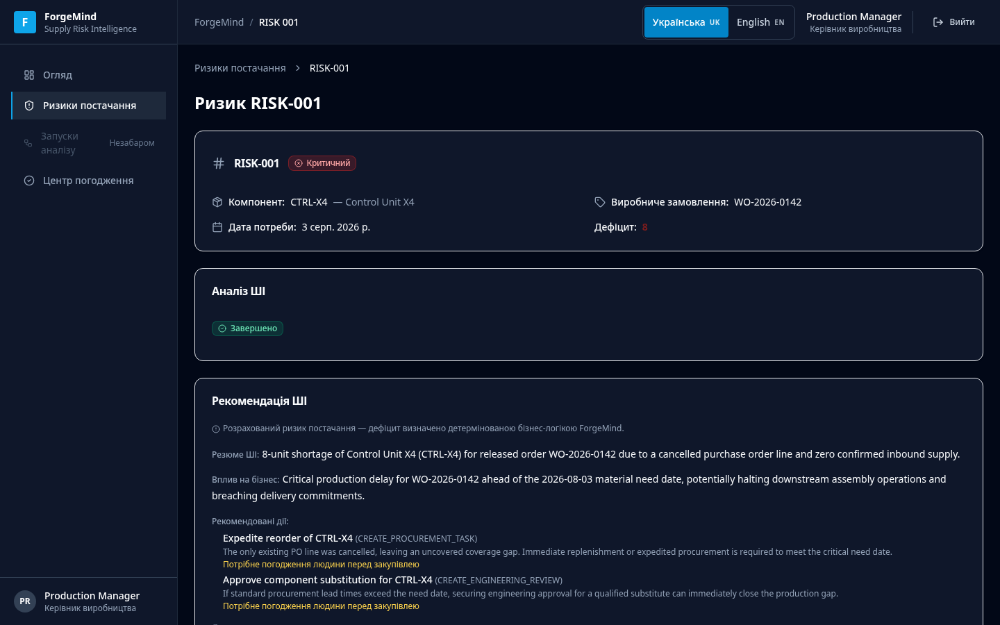
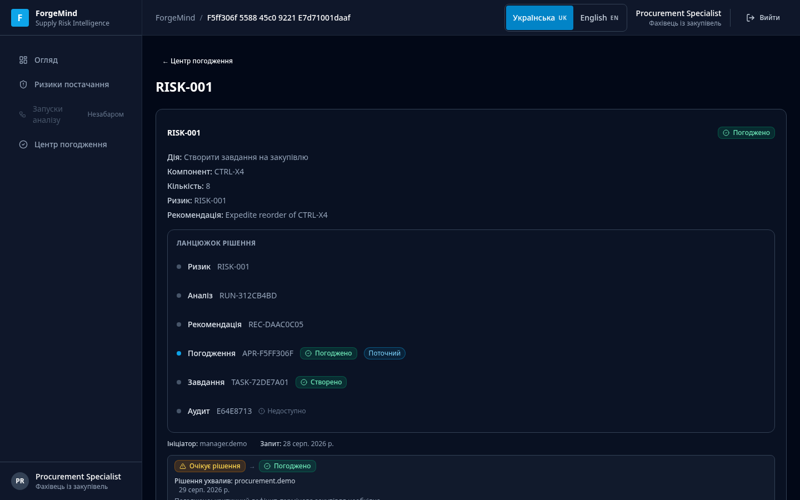

# Гайд для рекрутера — демо ForgeMind за 3–5 хвилин

**Мова:** Українська | [English README](../README.md)

**Живе демо:** https://demo.forgemind-ai.tech/ — публічне портфоліо-демо, розгорнуте та незалежно перевірене (2026-08-29).

Цей гайд показує один повний робочий цикл ForgeMind: керівник виробництва аналізує ризик і передає рекомендацію на погодження, фахівець із закупівель незалежно ухвалює рішення та створює завдання на закупівлю, аудитор переглядає незмінний журнал аудиту. Усі дані демо — синтетичні.

## Перед стартом

- **Різні ролі — різні контексти браузера.** Кожну роль відкривайте в окремому вікні інкогніто або окремому профілі браузера. В іншому разі остання авторизація перезапише попередню сесію.
- Паролі демо-облікових записів показано прямо на сторінці входу — вони не зберігаються в репозиторії.
- Час: приблизно 3–5 хвилин. Реєстрація не потрібна.

## Покрокова прогулянка

### 1. Відкрийте демо

Перейдіть на **https://demo.forgemind-ai.tech/**.

Очікуваний результат: сторінка входу українською з трьома кнопками демо-ролей — Керівник виробництва, Фахівець із закупівель, Аудитор. Паролі показано поруч із кнопками.

### 2. Увійдіть як Керівник виробництва

Натисніть кнопку демо-ролі «Керівник виробництва» (обліковий запис `manager.demo`) та увійдіть.

Очікуваний результат: робоча панель «Огляд» з активним виробничим планом, зведенням ризиків та останнім ШІ-аналізом.

### 3. Відкрийте ризик постачання

Розділ «Ризики постачання» → виберіть ризик `RISK-001` (позначку «Критичний»).

Очікуваний результат: картка ризику — компонент, виробниче замовлення, дефіцит — та блоки «Аналіз ШІ» і «Рекомендація ШІ» з варіантами дій і позначкою «Потрібне погодження людини перед закупівлею».

### 4. Передайте рекомендацію на погодження

Натисніть **«Передати на погодження»**. У модальному вікні нічого не вводьте вручну — жодних UUID чи ідентифікаторів не потрібно: запит формується автоматично з завершеної рекомендації (технічні ідентифікатори лише в згорнутому блоці «Технічні деталі»).

Очікуваний результат: запит на погодження створено; у ланцюжку рішення з'являється етап «Погодження» зі статусом «Очікує рішення».

### 5. Увійдіть як Фахівець із закупівель (окрема сесія)

У другому вікні інкогніто відкрийте демо та увійдіть як «Фахівець із закупівель» (`procurement.demo`).

Очікуваний результат: «Центр погодження» із запитом у статусі «Очікує рішення»; сторінка деталі показує ризик, рекомендацію та ланцюжок рішення.

### 6. Погодьте запит

Відкрийте запит → **«Погодити»** → (необов'язковий коментар) → **«Підтвердити погодження»**.

Очікуваний результат: статус «Погоджено», зафіксовано, хто ухвалив рішення й коли. Після оновлення сторінки запит залишається доступним для фахівця, який його погодив.

### 7. Створіть завдання на закупівлю

На погодженому запиті натисніть **«Створити завдання на закупівлю»**.

Очікуваний результат: завдання на закупівлю створено (статус «Створено»); кнопка зникає — повторне створення для того самого запиту неможливе. У ланцюжку рішення з'являється етап «Завдання» з ідентифікатором на кшталт `TASK-…`.

### 8. Перегляньте Ланцюжок рішення

Блок «Ланцюжок рішення» на сторінці запиту.

Очікуваний результат: читабельний ланцюжок «Ризик → Аналіз → Рекомендація → Погодження → Завдання → Аудит» із фінальними статусами кожного етапу. Він доступний лише для перегляду.

### 9. Увійдіть як Аудитор

У третьому контексті браузера увійдіть як «Аудитор» (`auditor.demo`).

Очікуваний результат: аудиторові доступні перегляд записів, ланцюжків рішень та журналу аудиту; кнопок погодження, відхилення чи створення завдань не існує. Журнал аудиту містить події на кшталт «Запит на погодження погоджено» / «…відхилено» з актором, часом та ідентифікаторами кореляції, а сторінка явно каже: події незмінні через цей інтерфейс.

### 10. (Необов'язково) Шлях відхилення

У сесії керівника передайте на погодження інший ризик (наприклад, `RISK-002`), а в сесії фахівця відхиліть його: «Відхилити» → причина → «Підтвердити відхилення».

Очікуваний результат: статус «Відхилено» із причиною; завдання на закупівлю не створюється. Відхилений запит залишається видимим для керівника-ініціатора та в журналі аудиту; фахівець, який ухвалив рішення, навмисно не має доступу до відхилених записів — це спроєктоване розділення ролей, а не втрата даних.

## На що звернути увагу

- **Жодного ручного введення UUID.** Запит на погодження створюється з завершеної рекомендації одним натисканням.
- **Самопогодження неможливе.** Керівник не бачить кнопок «Погодити»/«Відхилити» взагалі — навіть прямі API-спроби отримують 403.
- **Завдання лише з погодження.** Кнопка створення завдання з'являється тільки в погодженого запиту і зникає після створення.
- **Ланцюжок рішення збирається сам.** Ризик, аналіз, рекомендація, погодження, завдання та події аудиту пов'язані ідентифікаторами кореляції й читаються як одна історія.
- **Аудитор — лише читання.** Нуль можливостей мутації; журнал явно позначено як незмінний.

## Обмеження

- Усі дані — синтетичні (плани, BOM, постачальники, документи, події). Реальної ERP немає.
- Це спільне демо-середовище, а не персональна пісочниця: інші відвідувачі бачать той самий набір даних і результати ваших демо-дій (статуси запитів, створені завдання) до наступного планового скидання демо.
- Частина текстів ШІ-аналізу може залишатися англійською всередині українського інтерфейсу.
- У деяких рядках журналу аудиту може показуватися технічне повідомлення локалізації замість деталізації події; самі події коректні.
- Демо демонструє один вертикальний сценарій; повний інтерактивний мап документа-сліду (Document Trace Map), SLA та промислове розгортання — за межами цієї контрольної точки.

## Пов'язані документи

- [README українською](../README.uk.md)
- [Англомовний README](../README.md)
- [Контрольна точка Demo Pre-Release 1](demo-pre-release-1.md)
- [Ізольоване демо-середовище](demo-environment.md)
